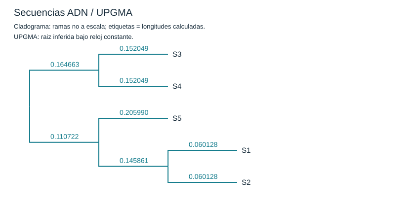
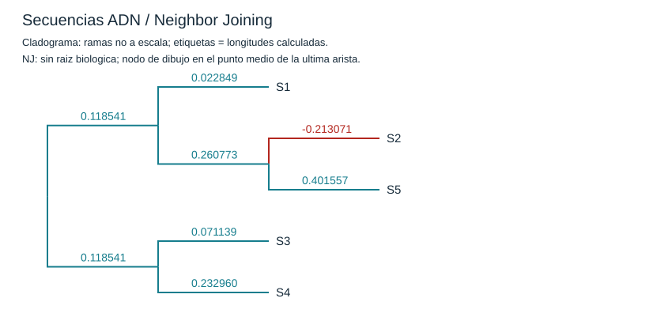
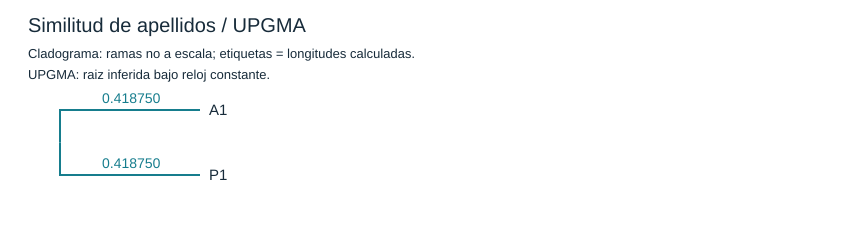
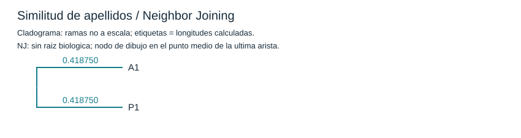

# Laboratorio 03a: Árboles filogenéticos

Implementación propia de **UPGMA y Neighbor Joining en C++17**, con cálculo de distancias, visualización SVG, exportación Newick y análisis de calidad.

**[Leer el informe PDF, sin carátula](output/pdf/Informe_Laboratorio_03a_Filogenia.pdf).**

Repositorio: https://github.com/GinoSebastianD/Molecular

## Contenido

- `src/phylogeny.hpp`: alineamiento global, Jukes-Cantor, distancias de apellidos, construcción de árboles, SVG y matrices.
- `src/main.cpp`: lectura de entradas, ejecución, métricas y diagnósticos.
- `tests/tests.cpp`: 19 pruebas con resultados de referencia y casos límite.
- `data/secuencias.fasta`: las cinco cadenas exactas del laboratorio.
- `data/apellidos_clase.csv`: Díaz Neyra (apellido proporcionado por el estudiante) y Túpac Valdivia (profesor identificado en la guía).
- `data/apellidos_demo.csv`: seis entradas **ficticias** para probar similitud y apellidos cruzados; no son alumnos reales.
- `resultados/`: resultados reproducibles, incluidos árboles SVG/Newick, matrices, alineamientos, métricas y pasos de fusión.
- `scripts/`: reproducción del experimento y generación del informe.
- `output/pdf/`: informe final.

La muestra disponible de la clase contiene **un estudiante y el profesor**. No se recibieron los apellidos de otros alumnos. Con dos personas el árbol es trivial; la demostración ficticia se entrega separada y no se presenta como una prueba con toda la clase.

## Ejecutar todo

Se necesita un compilador con C++17. Los algoritmos y la exportación de SVG no requieren bibliotecas externas.

Desde esta carpeta, en PowerShell con `g++` disponible:

```powershell
powershell -File scripts/reproducir.ps1
```

En Linux o macOS con `g++`:

```sh
sh scripts/reproducir.sh
```

Los scripts compilan, ejecutan las 19 pruebas y regeneran cuatro experimentos: ADN con hueco -2, ADN con hueco -1, apellidos disponibles y apellidos ficticios. Si ocurre un error, detienen la ejecución. El registro de pruebas está en `resultados/pruebas.txt`.

También puede compilarse con CMake:

```sh
cmake -S . -B build
cmake --build build --config Release
ctest --test-dir build -C Release --output-on-failure
```

Se verificó el proyecto con g++ 10.3.0 (TDM-GCC-64), `-std=c++17 -O2 -Wall -Wextra -Wpedantic`, sin advertencias. La ruta CMake se proporciona como alternativa; la validación ejecutada utilizó los comandos g++ del script PowerShell.

## Ejecutar por separado

Crear `build/` antes de compilar:

```sh
g++ -std=c++17 -O2 -Wall -Wextra -Wpedantic src/main.cpp -o build/filogenia
./build/filogenia dna data/secuencias.fasta resultados/adn
./build/filogenia dna data/secuencias.fasta resultados/adn_gap1 -1
./build/filogenia surnames data/apellidos_clase.csv resultados/apellidos_clase
```

En Windows use `build/filogenia.exe`. El compilador debe leer fuentes UTF-8; los scripts PowerShell fijan `-finput-charset=UTF-8 -fexec-charset=UTF-8` para GCC. Si compila con MSVC, utilice `/std:c++17 /utf-8`.

La interfaz es:

```text
filogenia dna entrada.fasta directorio_salida [penalidad_gap]
filogenia surnames entrada.csv directorio_salida
```

El modo ADN admite bases A/C/G/T, registros FASTA multilínea e identificadores únicos. El costo de hueco opcional es un entero entre -100 y -1. El programa devuelve 0 cuando termina correctamente, 1 ante datos o ejecución inválidos y 2 si faltan argumentos. Use un directorio distinto para cada experimento: los resultados con el mismo nombre se sobrescriben.

El CSV de apellidos debe ser UTF-8 sin BOM, con encabezado `id,paterno,materno`. Los identificadores admiten letras ASCII, números, guiones y guiones bajos; los campos no deben contener comas. Se admiten apellidos compuestos con espacios, guiones y apóstrofos. Se normalizan tildes, ü y ñ; otros caracteres no soportados se rechazan. Cambie el CSV o pase su archivo al script:

```powershell
powershell -File scripts/reproducir.ps1 -Apellidos data/mi_clase.csv
```

```sh
sh scripts/reproducir.sh data/mi_clase.csv
```

## Decisiones del experimento

1. Las secuencias tienen 9, 9, 10, 8 y 7 bases. Se alinean globalmente por pares mediante Needleman-Wunsch: coincidencia +2, sustitución -1 y hueco -2. Ante empate, el retroceso elige diagonal, arriba e izquierda, en ese orden.
2. Para cada par, `p = sustituciones / columnas base-base comparables`. Se excluyen las columnas con huecos y se registran sus conteos. Es una elección explícita de tratamiento de indels; no se supone que las cadenas originales ya estén alineadas.
3. Se calcula `d = -0.75 * ln(1 - 4*p/3)`. Se rechaza `p >= 0.75`; no se aplica un límite artificial. La corrección solo estima sustituciones nucleotídicas.
4. UPGMA promedia según el número de hojas de cada grupo. NJ utiliza la matriz Q y conserva ramas negativas para diagnosticar incompatibilidades. Ante empates de criterio a tolerancia absoluta `1e-12`, ambos conservan el primer par en el orden activo.
5. La distancia de apellidos es el mínimo entre el promedio de Levenshtein normalizado en orden paterno/materno y el promedio cruzado. No se aplica Jukes-Cantor a apellidos.
6. Los SVG son **cladogramas, no dibujos a escala**. Las longitudes aparecen escritas sobre cada rama; las negativas se dibujan en rojo. NJ se serializa con comentario `[&U]`; su raíz de dibujo solo subdivide la última arista en dos mitades. UPGMA se marca `[&R]`.

Los constructores usan O(n³) tiempo y O(n²) memoria numérica. El código privilegia claridad y trazabilidad para las muestras pequeñas de la práctica.

## Resultados principales

- ADN principal: RMSE de UPGMA **0.271091**; RMSE de NJ **0.048389**. NJ genera una rama **-0.213071**.
- La matriz principal viola ultrametricidad en 7 de 10 triples, desigualdad triangular en 4 de 10 y condición de cuatro puntos en 4 de 5 cuartetos.
- ADN con hueco -1: RMSE de UPGMA **0.233896**, NJ **0.174185**; NJ presenta tres ramas negativas.
- Apellidos disponibles: distancia **0.837500**; ambos árboles reproducen exactamente esa única distancia. Esto no permite comparar topologías alternativas.
- Demostración ficticia: RMSE de UPGMA **0.035544**, NJ **0.033472**, sin ramas negativas.

El error se calcula entre las distancias originales y las sumas algebraicas de las ramas en los caminos del árbol, sobre pares no ordenados sin diagonal. Un menor RMSE de NJ **no demuestra exactitud biológica**, especialmente cuando existen ramas negativas. Los alineamientos por pares comparan pocos sitios y pueden implicar homologías incompatibles. Las similitudes entre apellidos tampoco prueban parentesco.

## Visualizaciones

### ADN





### Apellidos disponibles

A1 = Díaz Neyra; P1 = Túpac Valdivia.





Las figuras de sensibilidad y de la demostración ficticia están en sus correspondientes subcarpetas de `resultados/`.

## Rehacer el PDF

Python se utiliza exclusivamente para maquetar el informe, **no para implementar los algoritmos**:

```sh
python -m pip install -r scripts/requirements-informe.txt
python scripts/generar_informe.py
```

El generador lee los CSV y SVG producidos por C++ y contiene el texto editable del informe. Si cambia las entradas o las reglas de distancias, actualice también el análisis escrito y sus ejemplos numéricos antes de regenerarlo. Los gráficos del PDF se dibujan a partir de las coordenadas de los SVG, sin reconstruir los árboles en Python.

## Fuentes

Base de construcción: material de clase **CMB_05_Phylogeny_2026-II.pdf**, diapositivas 53-63 y 66-67. Requisitos: **03a_UPGMA-NJ_Algorithms_2026-II (1).pdf**, pp. 1-2. Los originales proporcionados se usan como fuentes y no se redistribuyen en el repositorio.

Referencias complementarias: [artículo original de NJ](https://doi.org/10.1093/oxfordjournals.molbev.a040454), [tratamiento de huecos en MEGA](https://www.megasoftware.net/web_help_12/Alignment_Gaps_and_Sites_with_Missing_Information.htm) y [dominio de Jukes-Cantor](https://www.megasoftware.net/web_help_12/Jukes-Cantor_Distance_Failed.htm).
