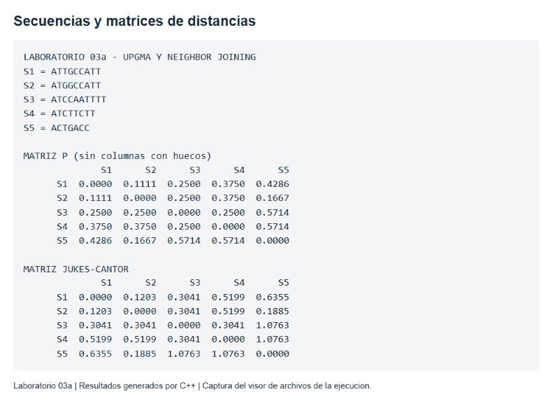
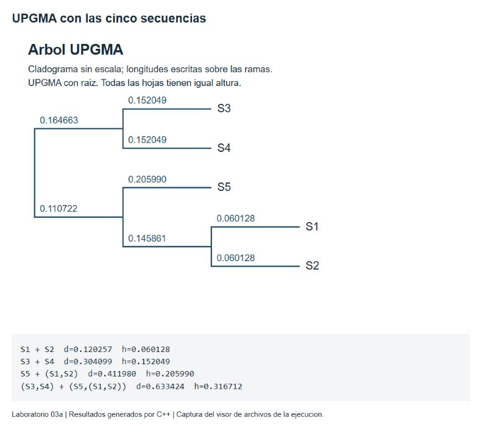
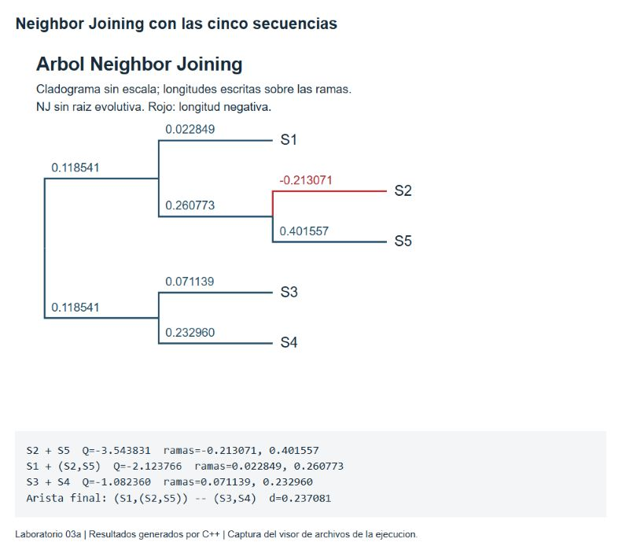
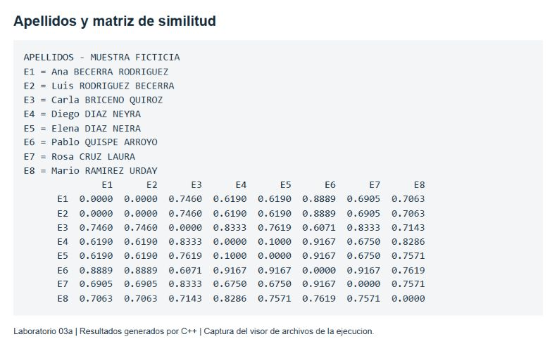
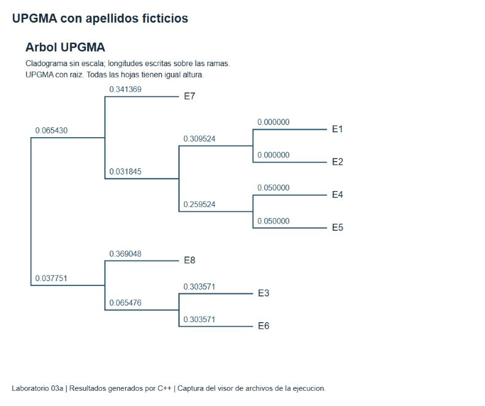
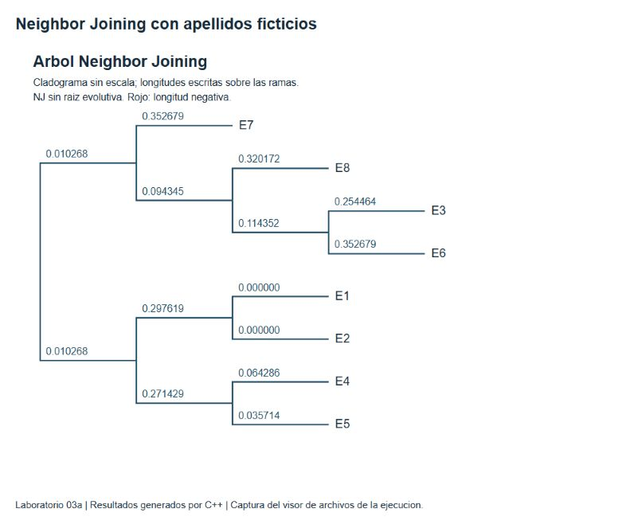
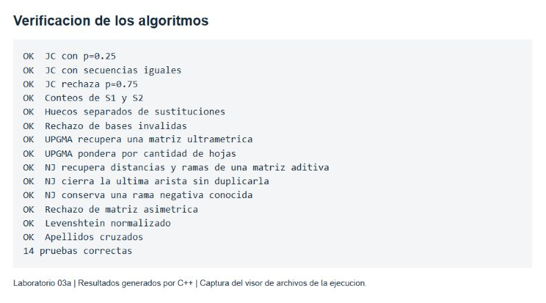

# Laboratorio 03a de árboles filogenéticos

**UPGMA y Neighbor Joining en C++**<br/>Gino Sebastián Díaz Neyra<br/>Biología Molecular Computacional CB309 · Universidad Católica San Pablo<br/>Docente: Yván Jesús Túpac Valdivia · Semestre 2026-II

## 1 Objetivos y desarrollo

Se implementaron dos métodos de construcción de árboles a partir de distancias: UPGMA y Neighbor Joining (NJ). Se probaron con las cinco secuencias de la guía y con ocho personas ficticias para comparar apellidos. El programa calcula matrices, registra las uniones y genera árboles SVG y archivos Newick.

NJ reprodujo mejor las distancias de ambas muestras. En ADN obtuvo un RMSE de **0.048389**, frente a **0.271091** de UPGMA; sin embargo, presentó una rama negativa. Por ello, el mejor ajuste numérico no se interpreta como una filogenia biológica confirmada.

**Objetivos:** implementar ambos algoritmos, visualizar sus resultados y analizar el efecto de las distancias utilizadas. La estructura general se orientó con el laboratorio público de Briceño [2]. La implementación usa vectores, funciones, ciclos y una estructura Nodo con índices enteros.

## 2 Datos y decisiones de implementación

Cadena | Secuencia de la guía | Longitud
--- | --- | ---
S1 | ATTGCCATT | 9
S2 | ATGGCCATT | 9
S3 | ATCCAATTTT | 10
S4 | ATCTTCTT | 8
S5 | ACTGACC | 7

Se conservó **S4 = ATCTTCTT**, tal como aparece en el PDF [1]. El archivo main.cpp del repositorio de referencia contiene ATCTTTCTT, con una T adicional. Esta diferencia puede cambiar la matriz y los árboles, por lo que no se copió esa cadena.

Las secuencias se alinearon por pares con Needleman-Wunsch: coincidencia +1, sustitución -1 y hueco -2. En un empate se elige diagonal, arriba e izquierda, en ese orden. Para contar sustituciones se excluyen las columnas con huecos; estos se registran por separado. La longitud usada en la fracción es el número de columnas base-base comparables [3].

**Repositorio de la entrega:** <a href="https://github.com/GinoSebastianD/Molecular/tree/main/lab3a" color="#175b88">github.com/GinoSebastianD/Molecular/tree/main/lab3a</a>

## 3 Matriz de distancias y corrección de Jukes Cantor

Para cada par, p es el número de sustituciones dividido entre las columnas comparables. Se aplica la corrección indicada en la guía para estimar sustituciones por sitio. Un valor de p mayor o igual que 0.75 no tiene una estimación finita en este modelo; el programa lo rechaza [4].

```text
p = diferencias / columnas comparables
d = -0.75 * ln(1 - 4*p/3)
```

Figura 1. Captura de la salida real de C++ en un visor: cadenas, matriz p y matriz corregida. Valores mostrados con cuatro decimales.



**Ejemplo S1 y S2.** Hay una diferencia en nueve posiciones: p = 1/9 = 0.111111. La distancia corregida es 0.120257. Es el menor valor de la matriz y determina la primera unión de UPGMA.

**Ejemplo S2 y S5.** El alineamiento tiene una sustitución, seis columnas comparables y cuatro columnas con hueco: p = 1/6 y d = 0.188486. Excluir huecos evita tratarlos como una quinta base, pero descarta información de inserciones y deleciones. Los diez alineamientos completos están en resultados/adn/alineamientos.txt.

Las cadenas son muy cortas y los pares no necesariamente comparten las mismas columnas homólogas. Esto limita la estabilidad del análisis. No se realizó un alineamiento múltiple ni se estimó soporte estadístico mediante bootstrap.

## 4 Construcción del árbol UPGMA

UPGMA une los dos grupos con menor distancia. La altura del nuevo nodo es la mitad de esa distancia; cada rama mide la altura nueva menos la altura del hijo. Al actualizar la matriz se pondera cada grupo por su número de hojas. Para una interpretación evolutiva presupone una tasa constante entre linajes [5].

```text
d(A unido B, K) = (nA*d(A,K) + nB*d(B,K)) / (nA+nB)
```

Figura 2. Árbol UPGMA y registro de las cuatro uniones. El dibujo muestra conectividad; las distancias se leen en las etiquetas, no en el tamaño de las líneas.



Primero se unen S1 y S2, con altura 0.060128. Luego se unen S3 y S4. S5 se incorpora al grupo S1-S2 y finalmente se unen los dos grupos restantes. La altura final es **0.316712**; la suma de ramas desde la raíz hasta cada hoja es igual.

El error RMSE es **0.271091**. Por ejemplo, el árbol representa la distancia S2-S5 como 0.411980, aunque la entrada es 0.188486. La restricción de alturas iguales obliga a promediar distancias diferentes.

## 5 Construcción del árbol Neighbor Joining

NJ selecciona vecinos usando la matriz Q, que considera la distancia del par y sus distancias al resto de nodos. Para m nodos activos, r(i) es la suma de la fila i. Las longitudes de las dos ramas pueden ser distintas [6].

```text
Q(i,j) = (m-2)*d(i,j) - r(i) - r(j)
L(i) = d(i,j)/2 + (r(i)-r(j))/(2*(m-2))
L(j) = d(i,j) - L(i)
d(u,k) = (d(i,k) + d(j,k) - d(i,j))/2
```

Figura 3. Árbol NJ y pasos de ejecución. La rama negativa de S2 está resaltada en rojo. La raíz del dibujo solo divide la última arista en dos partes iguales.



La primera unión es S2-S5, con Q = **-3.543831**. Sus ramas son -0.213071 y 0.401557. Después se agrega S1 a ese grupo y se unen S3-S4. NJ es un árbol sin raíz evolutiva; la posición izquierda del dibujo no identifica a un ancestro.

El RMSE disminuye a **0.048389**, pero la rama negativa no representa una distancia evolutiva válida. La matriz ya presenta una incompatibilidad: d(S1,S5) = 0.635473 supera d(S1,S2) + d(S2,S5) = 0.308743. Se conserva el valor negativo para mostrar el resultado del algoritmo y se incluye con su signo al calcular el error.

## 6 Comparación de apellidos

Se construyó una muestra ficticia de ocho personas usando combinaciones de apellidos del repositorio de referencia y dos variantes para comprobar semejanza y cruce. **Los nombres y asociaciones de esta muestra son de demostración; no representan una nómina real ni relaciones familiares verificadas.**

Se escribieron los apellidos en mayúsculas, sin tildes. Levenshtein cuenta inserciones, eliminaciones y sustituciones, todas con costo 1; luego se divide entre la longitud del apellido más largo. Para cada persona se comparan ambos apellidos en orden directo y cruzado, y se conserva el promedio menor.

```text
directo = (L(paterno1,paterno2) + L(materno1,materno2))/2
cruzado = (L(paterno1,materno2) + L(materno1,paterno2))/2
distancia = min(directo, cruzado)
```

Figura 4. Personas ficticias y matriz de distancias. Cero indica máxima similitud textual según la regla implementada; no implica que sean la misma persona.



**E1 y E2:** Becerra Rodríguez y Rodríguez Becerra coinciden al cruzar los apellidos, de modo que su distancia es 0. **E4 y E5:** Díaz Neyra y Díaz Neira tienen un cambio en un apellido de cinco letras; la distancia de la pareja es (0 + 1/5)/2 = **0.100000**.

Jukes-Cantor se aplica únicamente a ADN. Los apellidos utilizan un alfabeto y una interpretación distintos, por lo que se conservó la distancia textual normalizada.

## 7 Árbol UPGMA de apellidos

UPGMA se ejecutó sobre la matriz de apellidos con la misma función utilizada para ADN. Las etiquetas E1-E8 corresponden a las personas de la figura 4. Las longitudes son distancias textuales, sin unidades biológicas.

Figura 5. UPGMA aplicado a las ocho personas ficticias. Las ramas de E1 y E2 son cero, aunque se dibujan con espacio para distinguir sus etiquetas.



El primer grupo está formado por **E1 y E2**, y el segundo por **E4 y E5**. Son los casos introducidos para comprobar apellidos cruzados y una diferencia de una letra. La siguiente unión es E3-E6, con distancia 0.607143. Esta agrupación refleja la comparación de letras, no un parentesco conocido.

La altura final es **0.406799**. El RMSE de la reconstrucción es **0.055666** y no hay ramas negativas. El registro de las siete uniones está en resultados/apellidos/upgma_pasos.txt.

**Comprobación del promedio.** El grupo E1-E2 tiene dos hojas y el grupo E4-E5 también tiene dos. Al incorporar otros grupos, la actualización usa esas cantidades; promediar todos los grupos con el mismo peso produciría un método diferente.

## 8 Árbol NJ y comparación de calidad

NJ también conserva los pares E1-E2 y E4-E5. La forma de conectar los otros grupos se obtiene mediante Q; no exige que todas las hojas tengan la misma distancia a la raíz utilizada para dibujar.

Figura 6. NJ sobre la muestra ficticia. No se obtuvieron ramas negativas en este experimento.



Datos | RMSE UPGMA | RMSE NJ | Ramas negativas NJ
--- | --- | --- | ---
ADN · 10 pares | 0.271091 | 0.048389 | 1
Apellidos · 28 pares | 0.055666 | 0.022258 | 0

El RMSE es la raíz del promedio del error al cuadrado entre cada distancia de entrada y la suma de ramas que conecta las hojas correspondientes. Se consideran pares distintos sin repetir y se excluye la diagonal. Los valores se comparan **dentro de cada conjunto de datos**, porque ADN y apellidos tienen interpretaciones diferentes.

**¿Existe consistencia con posibles parentescos?** Los grupos coinciden con similitudes textuales previsibles: apellidos iguales, cruzados o casi iguales. Esto no demuestra parentesco. Además, la muestra es ficticia; no se dispone de genealogía ni de datos genéticos de esas personas para verificar una relación familiar.

## 9 Ejecución y comprobaciones

La implementación usa C++17 y la biblioteca estándar. Se compiló con g++ 10.3.0 en Windows, activando -Wall -Wextra -Wpedantic, sin advertencias. Desde lab3a se puede reproducir el cálculo con:

```text
mkdir build
g++ -std=c++17 -O2 -Wall -Wextra -Wpedantic main.cpp -o build/filogenia
./build/filogenia
g++ -std=c++17 -O2 pruebas.cpp -o build/pruebas
./build/pruebas
```

En Windows los ejecutables llevan extensión .exe. main.cpp contiene las entradas; distancias.h calcula distancias; arboles.h implementa UPGMA y NJ; salida.h escribe matrices, SVG y Newick. evidencias.cpp prepara los visores HTML para capturar los archivos de resultados. No se necesita Graphviz para dibujar los árboles.

Figura 7. Captura del registro real de las 14 pruebas satisfactorias. Incluye matrices con solución conocida, ponderación de grupos, cierre de NJ y rechazo de entradas inválidas.



**Conclusiones.** Ambos algoritmos producen árboles reproducibles y visualizables. UPGMA es sencillo y aplica promedios ponderados; NJ se ajustó mejor a estas matrices. La rama negativa del ADN y la corta longitud de las secuencias impiden considerar ese ajuste una validación biológica. Los árboles de apellidos describen similitud escrita, no parentesco.

## Referencias

[1] Túpac Valdivia, Y. J. (2026). <i>Laboratorio 03a Árboles Filogenéticos</i>. Guía de la actividad, pp. 1-2.<br/>[2] Briceño, A. <a href="https://github.com/aaabriceno/CompMolecular/tree/main/labs/lab3a" color="#175b88">CompMolecular · labs/lab3a</a>. Referencia de organización y apellidos.<br/>[3] MEGA. <a href="https://www.megasoftware.net/web_help_12/Alignment_Gaps_and_Sites_with_Missing_Information.htm" color="#175b88">Alignment Gaps and Sites with Missing Information</a>.<br/>[4] MEGA. <a href="https://www.megasoftware.net/web_help_12/Jukes-Cantor_Distance_Failed.htm" color="#175b88">Jukes-Cantor Distance Failed</a>.<br/>[5] MEGA. <a href="https://www.megasoftware.net/mega1_manual/Phylogeny.html" color="#175b88">Phylogenetic Inference, sección 5.3</a>.<br/>[6] Saitou, N. y Nei, M. (1987). <a href="https://pubmed.ncbi.nlm.nih.gov/3447015/" color="#175b88">The neighbor-joining method</a>. Molecular Biology and Evolution, 4(4), 406-425.
