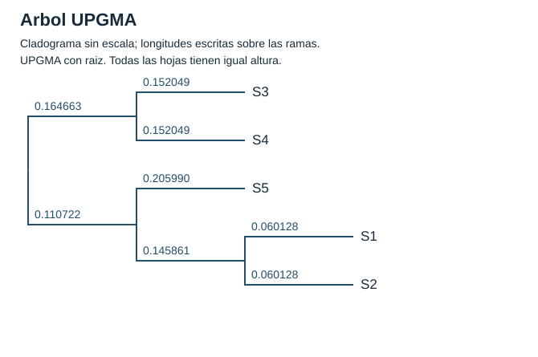
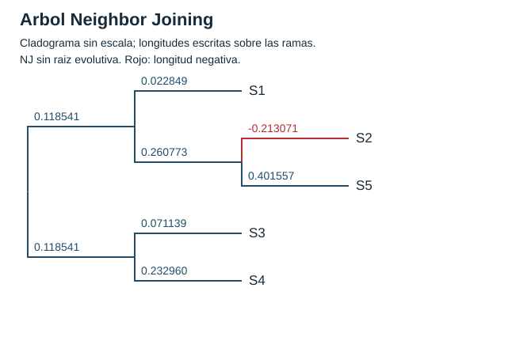
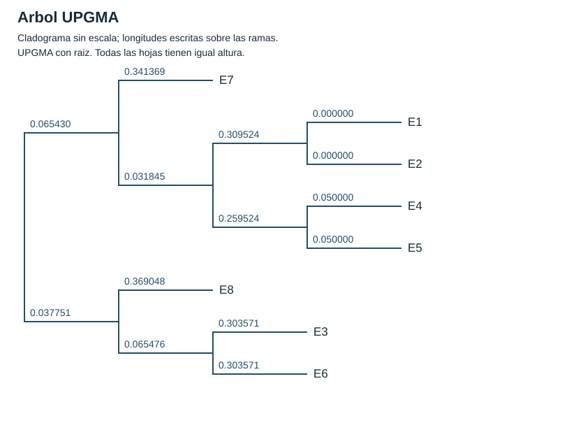
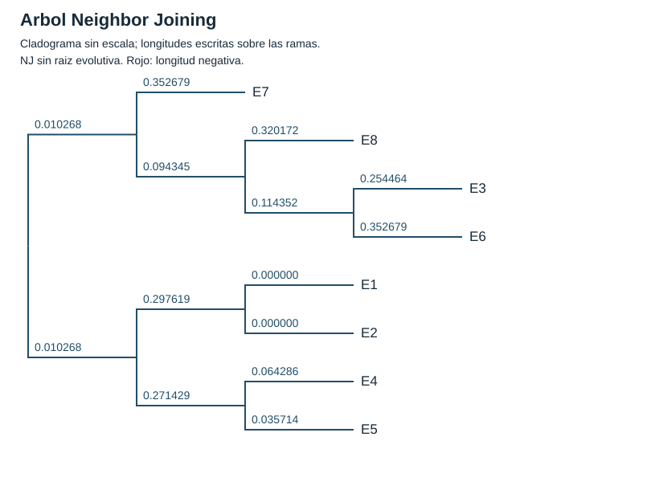

# Laboratorio 03a de árboles filogenéticos

**Gino Sebastián Díaz Neyra · Biología Molecular Computacional · 2026-II**

Implementación sencilla de **UPGMA y Neighbor Joining en C++17**, con matrices de distancias, alineamiento de ADN, comparación de apellidos y visualización de árboles.

## Informe y capturas

- **[Abrir el informe PDF de ocho páginas](output/pdf/Informe_Laboratorio_03a.pdf).**
- [Leer el informe en Markdown](INFORME.md).
- [Ver las siete capturas](capturas/).
- [Consultar la salida completa de la ejecución](resultados/ejecucion.txt).
- [Consultar las 14 pruebas satisfactorias](resultados/pruebas.txt).

Las capturas se tomaron en un navegador que mostraba los archivos reales generados por C++. Son capturas de un visor de resultados, no de una consola interactiva. Los HTML del visor y los registros se conservan para contrastar la evidencia. Los números de las figuras coinciden con los resultados de esta implementación.

## Archivos del programa

- `main.cpp`: cinco cadenas de la guía, muestra ficticia de apellidos y ejecución de los dos algoritmos.
- `distancias.h`: alineamiento Needleman-Wunsch, corrección de Jukes-Cantor y Levenshtein normalizado.
- `arboles.h`: estructura `Nodo`, UPGMA, NJ y cálculo del error de reconstrucción.
- `salida.h`: matrices, pasos, árboles Newick y dibujos SVG.
- `pruebas.cpp`: comprobaciones numéricas y entradas inválidas.
- `evidencias.cpp`: genera las páginas HTML usadas para tomar las capturas.

Se usan funciones, vectores, ciclos e índices enteros. Los árboles se almacenan en un vector: primero las hojas y después los nodos que se van creando. No se usan punteros inteligentes ni bibliotecas externas. Todo el código de los algoritmos, visualizaciones y pruebas está en C++.

## Compilar y ejecutar

Se requiere un compilador con soporte de C++17. Los comandos se ejecutan **desde esta carpeta `lab3a`**. Se comprobó con g++ 10.3.0 en Windows, sin advertencias.

### Windows con PowerShell

```powershell
New-Item -ItemType Directory -Force build | Out-Null
g++ -std=c++17 -O2 -Wall -Wextra -Wpedantic main.cpp -o build/filogenia.exe
./build/filogenia.exe

g++ -std=c++17 -O2 -Wall -Wextra -Wpedantic pruebas.cpp -o build/pruebas.exe
./build/pruebas.exe | Tee-Object -FilePath resultados/pruebas.txt

g++ -std=c++17 -O2 -Wall -Wextra -Wpedantic evidencias.cpp -o build/evidencias.exe
./build/evidencias.exe
```

### Linux o macOS con g++

```sh
mkdir -p build
g++ -std=c++17 -O2 -Wall -Wextra -Wpedantic main.cpp -o build/filogenia
./build/filogenia
g++ -std=c++17 -O2 -Wall -Wextra -Wpedantic pruebas.cpp -o build/pruebas
./build/pruebas > resultados/pruebas.txt
g++ -std=c++17 -O2 -Wall -Wextra -Wpedantic evidencias.cpp -o build/evidencias
./build/evidencias
```

Continúa con el siguiente comando únicamente si la compilación o ejecución anterior terminó correctamente. La validación realizada fue en Windows; los comandos de Linux y macOS se proporcionan como equivalentes.

El programa principal admite un directorio de salida opcional: `./build/filogenia otra_salida`. Los archivos con el mismo nombre se reemplazan. `evidencias.cpp` lee siempre la carpeta `resultados` y genera únicamente los HTML; las capturas PNG se toman después abriendo esos HTML en un navegador. Al cambiar entradas se deben actualizar las capturas y el análisis del informe.

## Decisiones del cálculo

1. **Datos del PDF:** S1 `ATTGCCATT`, S2 `ATGGCCATT`, S3 `ATCCAATTTT`, S4 `ATCTTCTT`, S5 `ACTGACC`. S4 tiene ocho bases; la referencia de Briceño incluye una T adicional en esa cadena.
2. **Alineamiento por pares:** coincidencia +1, sustitución -1 y hueco -2. El retroceso resuelve empates en orden diagonal, arriba, izquierda.
3. **ADN:** `p = sustituciones / columnas base-base comparables`. Los huecos se excluyen y se cuentan por separado. Se aplica `d = -0.75 * ln(1 - 4*p/3)` y se rechaza `p >= 0.75`. Las diez comparaciones están en `resultados/adn/alineamientos.txt`.
4. **Apellidos:** ocho personas **ficticias**, con apellidos inspirados en el ejemplo de referencia. Se trabaja en mayúsculas ASCII sin tildes. Se toma el mínimo entre el promedio de Levenshtein normalizado directo y cruzado. No se aplica Jukes-Cantor a texto.
5. **UPGMA:** las distancias se ponderan por el número de hojas de cada grupo. La altura del nodo es la mitad de la distancia elegida.
6. **NJ:** se minimiza Q; las ramas negativas se conservan y se muestran en rojo. El último enlace se divide por la mitad para dibujarlo; esto no establece una raíz evolutiva.
7. **Empates de agrupamiento:** dentro de una tolerancia absoluta de `1e-12` se conserva el primer par de índices activos. Las hojas mantienen su orden inicial y los grupos nuevos se agregan al final.
8. **Visualización:** C++ escribe SVG que se pueden abrir en un navegador. Son cladogramas sin escala; los valores escritos indican las longitudes. Los Newick se marcan `[&R]` para UPGMA y `[&U]` para NJ y se exportan con seis decimales.

UPGMA y NJ usan O(n³) tiempo y O(n²) memoria numérica. El alineamiento y Levenshtein usan una matriz proporcional al producto de las longitudes de las dos cadenas.

## Resultados

- **ADN:** RMSE UPGMA = **0.271091**; RMSE NJ = **0.048389**. NJ produce una rama de **-0.213071** hacia S2.
- **Apellidos ficticios:** RMSE UPGMA = **0.055666**; RMSE NJ = **0.022258**. No hay ramas negativas.
- **Casos previstos:** Becerra Rodríguez y Rodríguez Becerra tienen distancia cero; Díaz Neyra y Díaz Neira tienen distancia 0.1.

El RMSE compara las distancias de entrada con las sumas de ramas del camino entre cada par de hojas; las ramas negativas conservan su signo. No se incluyen la diagonal ni pares repetidos. Un mejor ajuste numérico no demuestra una filogenia correcta: las secuencias son muy cortas y el resultado depende del alineamiento y del tratamiento de huecos. La similitud entre apellidos tampoco demuestra parentesco.

### Árboles de ADN





### Árboles de apellidos ficticios

Las etiquetas E1-E8 se describen en [personas.csv](resultados/apellidos/personas.csv).





## Referencias

- Guía del docente: `03a_UPGMA-NJ_Algorithms_2026-II (1).pdf`, pp. 1-2. Se utilizó como fuente y no se redistribuye aquí.
- [Briceño, CompMolecular, laboratorio 3a](https://github.com/aaabriceno/CompMolecular/tree/main/labs/lab3a): organización general, flujo de trabajo y apellidos de referencia. Esta entrega reimplementa el cálculo con nodos indexados y separa el tratamiento de los dos apellidos.
- [MEGA: tratamiento de huecos](https://www.megasoftware.net/web_help_12/Alignment_Gaps_and_Sites_with_Missing_Information.htm).
- [MEGA: dominio de Jukes-Cantor](https://www.megasoftware.net/web_help_12/Jukes-Cantor_Distance_Failed.htm).
- [MEGA: UPGMA y NJ](https://www.megasoftware.net/mega1_manual/Phylogeny.html).
- [Saitou y Nei (1987): artículo original de NJ](https://pubmed.ncbi.nlm.nih.gov/3447015/).
